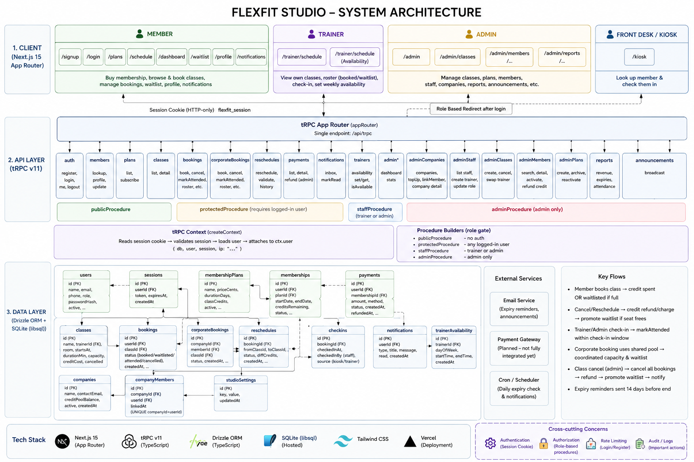
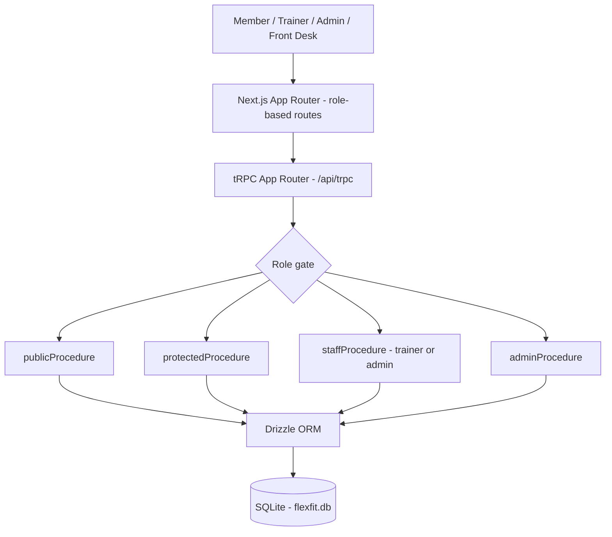

# FlexFit Studio

Class booking and membership management for a single gym site. Members book classes, buy memberships and spend class credits. Staff run the front desk, manage trainers and pull reports. Companies buy credit pools their employees book against.

## Requirements

Node 20 or newer, and pnpm. If you don't have pnpm:

```bash
npm install -g pnpm
```

The database is SQLite and lives in a file. There's no server to install and no account to create.

## Getting set up

```bash
pnpm install
pnpm db:push
pnpm db:seed
pnpm dev
```

That gets you a populated studio at http://localhost:3000 with a couple of weeks of classes either side of today.

`db:push` creates `flexfit.db` and applies the schema. `db:seed` fills it with sample members, plans, classes and bookings.

## Signing in

| Role    | Email                  | Password   |
| ------- | ---------------------- | ---------- |
| Admin   | admin@flexfit.test     | admin123   |
| Trainer | arjun@flexfit.test     | trainer123 |
| Member  | rahul.k@example.com    | member123  |

Every seeded member uses `member123`. The other member emails are in `src/db/seed.ts`.

## Commands

| Command         | What it does                                      |
| --------------- | ------------------------------------------------- |
| `pnpm dev`      | Development server on port 3000                    |
| `pnpm build`    | Production build                                   |
| `pnpm db:push`  | Apply the schema in `src/db/schema.ts`             |
| `pnpm db:seed`  | Wipe the data and reseed                           |
| `pnpm db:reset` | Delete the database file, then push and seed again |

`db:reset` is the one you want when the data gets into a state you don't like. It's destructive and it's meant to be.

## Two things that will waste your time

Don't run `pnpm build` while `pnpm dev` is running. The build writes over the directory the dev server is using and the app starts throwing `MODULE_NOT_FOUND`. Nothing is actually broken. Stop the dev server, delete `.next`, start it again. If you want to typecheck while the server is up, use `npx tsc --noEmit` instead.

If you're changing anything in `src/db/schema.ts`, run `pnpm db:push` afterwards or the app and the database will disagree with each other in confusing ways.

## Layout

```
src/
  app/          routes and pages
  components/   shared components
  db/           schema, client, seed data
  features/     domain logic - backend services and frontend components, grouped by feature
  lib/          helpers
  server/       tRPC routers
documents/      restructuring plan, defect log, and architecture decisions
```

## System Architecture



Client (Next.js App Router, role-based routes for member/trainer/admin/kiosk) talks to a single tRPC endpoint. Every procedure sits behind a role gate (`public`, `protected`, `staff`, `admin`), backed by Drizzle ORM over SQLite.

**Request flow:**



## Restructuring

The original app worked correctly but had grown through five developers who never spoke to each other: oversized route files, and the same logic duplicated across routers. This codebase went through a full restructuring pass on top of that: route files were split into single-purpose modules under `src/features/*` (services on the backend, components on the frontend), and repeated logic was consolidated into one place per concern.

Every change was verified to leave existing behavior untouched - live in a running browser for the frontend, before/after tests for the backend - except for a handful of real defects that were explicitly triaged and fixed, each logged with its own defect ID. The full change history, defect log, and reasoning behind every structural decision live in [`documents/`](documents/).

## Contributors

**[m-karthika14](https://github.com/m-karthika14)**
Led the restructuring pass end to end (backend service extraction, frontend component extraction, defect triage, final verification). Also: consistent role-based access gating across staff pages, member signup flow, corporate booking UI, profile editing, class cancellation cleanup and notifications, roster privacy fix, waitlist-promotion notifications, expiring-membership reminders, and admin class scheduler fixes (cancel routing, mutation error surfacing).

**[KarthikKP2005](https://github.com/KarthikKP2005)**
Built the core admin panel (CRM, plans, classes, trainer overrides, analytics, studio settings, staff management, forgot-password flow) and led UI/UX passes across the app. Also: database indexing for schedule performance, transaction safety and waitlist-concurrency fixes, and trainer availability handling.

**[narenyash](https://github.com/narenyash)**
Fixed membership and payment correctness issues (current-membership resolution, refund cleanup, atomic subscribe with collision-resistant payment references, duplicate-subscription rejection), enforced one company per member, fixed kiosk check-in blocking on zero credits, and reworked the reschedule modal's state handling. Also added name/date/time filtering across the schedule, dashboard, trainer schedule, and admin classes views.
